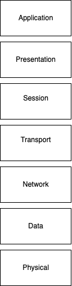

The OSI model is a blueprint demonstrating how data travel from one device to another over a network via 7 layers. 

The 7 layer include:

1) Physical - This layer includes the wires and waves  such as bluetooth, wifi radio signals, or USB.

2) Data Link - This layer demonstrates how data moves across the network. MAC adresses are the lcoal name tags that are used here. In the Data link layer, you will find that ethernet and wifi belong in this layer.

3) Network - The network layer is where the IP address lives, it is also somewhat a GPS, navigating your data across the internet. examples include:
IPv4, IPv6, ICMP (used for pinging, check if your online or not) nd IGMP (used for streaming, or group chats aka multicast)

4) Transport - The transport layer is what send chunks of your data AKA packets, to one place ensuring it all gets there in one piece. Protocols used for Transport are UDP and TCP

5) Session - The Session Layer is making sure what ever is running, is live ie a zoom call or a video games. Protocols used for the Session layer are NetBIOS (old windows file sharing) and RPC (used in app that call other apps over the network)

6) Presentation - This layer is where data gets encrypted and made readable. TL;DR it makes the data look pretty. protocols used in this layer are TSL/SSL (encryption for HTTPS), MIME (for email attachments sucha s PDFs or GIFS), ASCII / JPEG/ PNG (different encoding types for text/images)

7) Application - This layer is the USER, it is where all kinds of app live and interact with the network. Protocols used for this layer would be HTTP/HTTPS (websites when your googling something), FTP (file transfers), SMTP (email stuff), DNS(turns google.com into an IP address), and SSH(secure remote login)

